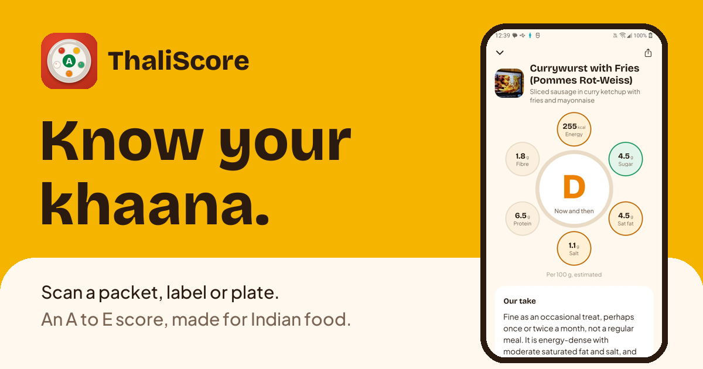

# ThaliScore

Know your khaana. Scan a packet, its nutrition label or your plate and get an A to E score made for Indian food, with palm oil and added sugar flags, who it suits, a Child mode, and long-term effects in plain words.

**[Download the latest APK](https://github.com/JhaniLive/thaliscore-app/releases/latest/download/ThaliScore.apk)** ·
[Website](https://jhanilive.github.io/thaliscore-app/) ·
[Privacy policy](https://jhanilive.github.io/thaliscore-app/privacy-policy.html)

## Install
1. On your Android phone (Android 7 or newer, 64-bit), open the download link above.
2. Open `ThaliScore.apk`. If asked, allow your browser to install unknown apps.
3. Tap **Install**, open ThaliScore and allow the camera.

ThaliScore was called NutriScan before version 1.1.0. It installs over NutriScan and keeps your scans.

This repository holds the website (`docs/`, served by GitHub Pages) and the APK releases.

Made with ❤ by Jhani
